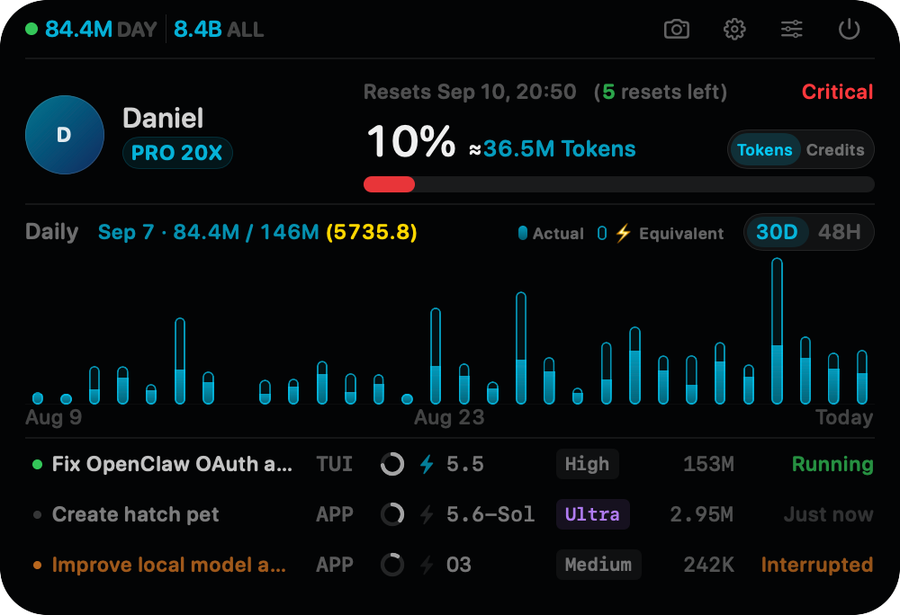
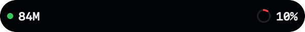
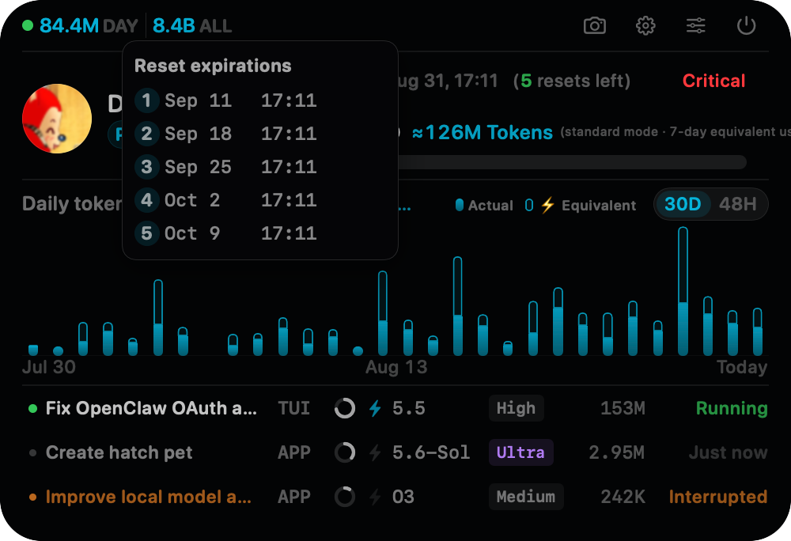
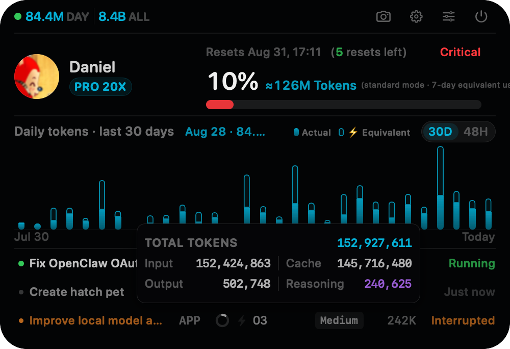
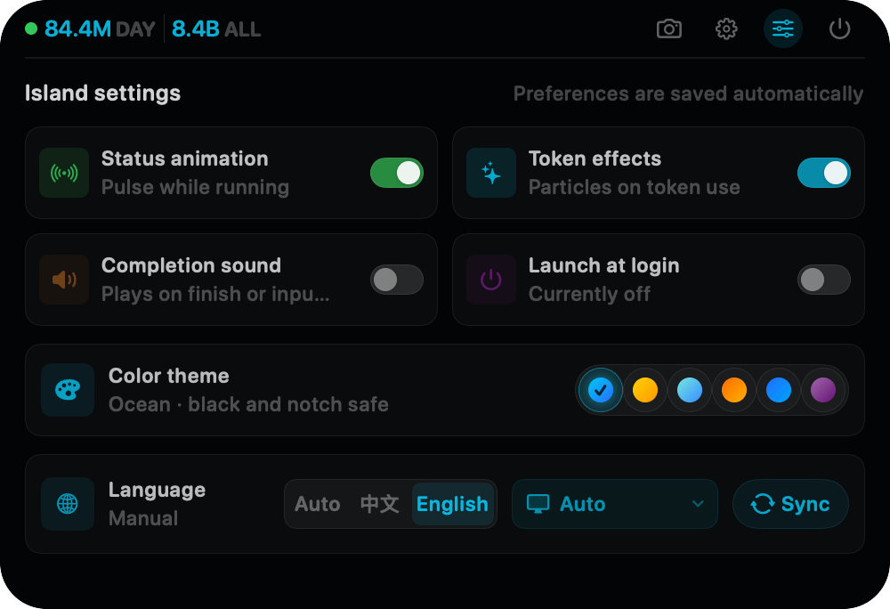

# Codex Island

**English** | [简体中文](README.zh-CN.md)

Codex Island is a floating status island for the top of macOS. It stays compact by default and expands on hover to show Codex account limits, profile identity, lifetime and recent token activity, plus each recent thread's model, reasoning effort, Fast status, and cumulative token usage.

Account details, usage, and the thread index come from read-only endpoints exposed by the local `codex app-server`. Per-thread configuration comes from the latest `thread_settings_applied` event in that thread's local rollout. The profile name and avatar are fetched on demand from the Profile endpoint used by the Codex App; the authentication token is retained only in memory for the duration of the request and is never written to disk or logs. Codex Island does not parse message bodies or call endpoints that consume reset credits.

## Interface Preview

### Expanded



> These screenshots are generated by the built-in offscreen preview renderer. Limits, token counts, plan, dates, and thread content shown in them are demonstration data.

### Compact

| Idle | Consuming tokens |
| :---: | :---: |
|  |  |

### Hover Details

**Reset credit expirations**



**Thread token details**



### Settings



## Install and Run

Pulling the latest source and building locally is recommended. You can also download the latest prebuilt release.

> [!IMPORTANT]
> This project is not signed with an Apple Developer ID certificate and has not been notarized by Apple. When you download the DMG directly, macOS Gatekeeper will typically warn that it cannot verify the developer or that the app may pose a security risk. Build locally using the instructions below if you want to avoid this downloaded-app verification warning.

### Recommended: Build the Latest Source Locally

Requirements: macOS 13 or later, the Swift 6 toolchain, and an installed and authenticated Codex CLI.

Clone the repository for the first time:

```bash
git clone https://github.com/daniel-weih/codex-island.git
cd codex-island
```

If you already have a clone, update it first:

```bash
git pull --ff-only
```

Run directly:

```bash
swift run
```

Package an `.app`:

```bash
./scripts/package_app.sh
open "dist/Codex Island.app"
```

Package the app, DMG, and mounted-volume icon:

```bash
./scripts/package_dmg.sh
open "dist/Codex-Island.dmg"
```

### Download the DMG (Alternative)

**[Download Codex Island DMG](https://github.com/daniel-weih/codex-island/releases/download/v2026.07.27/Codex-Island.dmg)**

The current release is `v2026.07.27` and supports Apple Silicon Macs running macOS 13 or later. The package uses an ad-hoc signature. If macOS blocks the first launch, Control-click the app in Finder and choose **Open**.

### Launch at Login

Launch at login can be enabled in Codex Island settings and is disabled by default. Once enabled, the app writes only its own launch agent under the current user's `~/Library/LaunchAgents/` directory and starts automatically from the next macOS login. The launch agent starts Codex Island directly, so macOS does not identify the background item as the generic `open` command. Legacy launch items are migrated automatically while preserving the enabled state. This mechanism requires neither an Apple Developer certificate nor administrator privileges. Turning it off removes only the Codex Island launch agent and does not affect other login items.

### Development and Validation

If `codex` is not in a common executable path, specify it explicitly:

```bash
CODEX_CLI_PATH=/path/to/codex swift run
```

Run parser checks:

```bash
./scripts/test.sh
```

Probe the local App Server connection in read-only mode (without printing tokens, email addresses, or thread content):

```bash
swift run CodexIsland --probe
```

Render the offscreen preview matrix for compact and expanded states, hover cards, narrow layouts, notchless displays, 1x/2x scales, and data-boundary cases:

```bash
swift run CodexIsland --render-preview dist/previews
```

## Features

- A centered, borderless floating panel visible across all Spaces, adapted for both notched Mac displays and standard external displays
- Automatic expansion when the pointer enters the physical notch area, followed by automatic collapse after the pointer leaves both the notch and expanded panel
- Today's token increase across local root threads in the left side of the compact island; while tokens are being consumed continuously, particles flow from the notch toward the daily-token total; the status dot is green while any thread is running and gray otherwise
- Remaining primary rate-limit percentage and the next reset time
- Available reset credits from `rateLimitResetCredits.availableCount`, with all expiration times available on hover
- Profile avatar and name, lifetime account tokens, and a daily token chart covering the latest 30 complete calendar days
- Activation of the Codex App by clicking any non-thread area in the expanded island, plus the official settings deep link from the top-right gear button
- Settings for status animation, token-consumption animation, interface language, target display, and launch at login; target display defaults to automatic and can be pinned to the built-in display or any connected external display, with temporary fallback after disconnection and automatic restoration after reconnection; launch at login is disabled by default
- Codex account plan plus each of the five most recent CLI/App threads' model, reasoning effort, and Fast status
- Near-real-time execution state for the five most recent threads: running, idle, interrupted, or failed
- Cumulative token usage for the five most recent threads, with input, cached-input, output, and reasoning-output details on hover
- Opening a thread in the Codex App by clicking its row through the official `codex://threads/<thread-id>` deep link
- Thread list and execution state refresh every second, limits every 30 seconds, and account statistics every 5 minutes; there is no menu bar icon or manual-show entry point

> Execution state is derived from local rollout lifecycle events written by both the CLI and App, and normally updates within one second. If a Codex process exits abnormally without writing a terminal event, an unclosed task with no activity for an extended period is downgraded to **Unknown** instead of being reported as running indefinitely.

## Data Boundaries

The app launches a local `codex app-server` child process over stdio. After `initialize`, it periodically calls:

- `account/read`
- `account/rateLimits/read`
- `account/usage/read`
- `thread/list`

All business-data calls are read-only. To obtain the Codex App profile name and avatar, Codex Island temporarily requests the current token from the local App Server through `getAuthStatus`, then calls the `/wham/profiles/me` endpoint used by the Codex App. The network session uses an ephemeral configuration with no cookies or disk cache; after a 401 response, the token is refreshed and the request is retried at most once. This Profile endpoint is not a public contract. If it fails, the UI falls back to **Codex User** and an initial-letter placeholder without reading the local account name or system avatar, and limits, usage, and thread status remain unaffected.

Codex Island also discovers local root CLI/App threads read-only under `$CODEX_HOME/sessions` and `$CODEX_HOME/archived_sessions`, then scans the corresponding `.jsonl` files. Recent threads are labeled `TUI` or `APP` using the `source` returned by `thread/list`; only model settings, timestamped cumulative `token_count` values, and the `task_started`, `task_complete`, `turn_aborted`, and `error` lifecycle events are extracted. Daily usage is calculated from positive deltas between cumulative values, so repeated notifications are not double-counted. Forks and sub-agent threads copy their parent's history and are currently excluded from this total. The recent-thread list, execution state, and cumulative tokens refresh every second; the complete local thread index refreshes every 15 seconds; limits refresh every 30 seconds; account statistics use a 5-minute cache; and profile identity uses a 15-minute cache. The child process exits together with the app.
