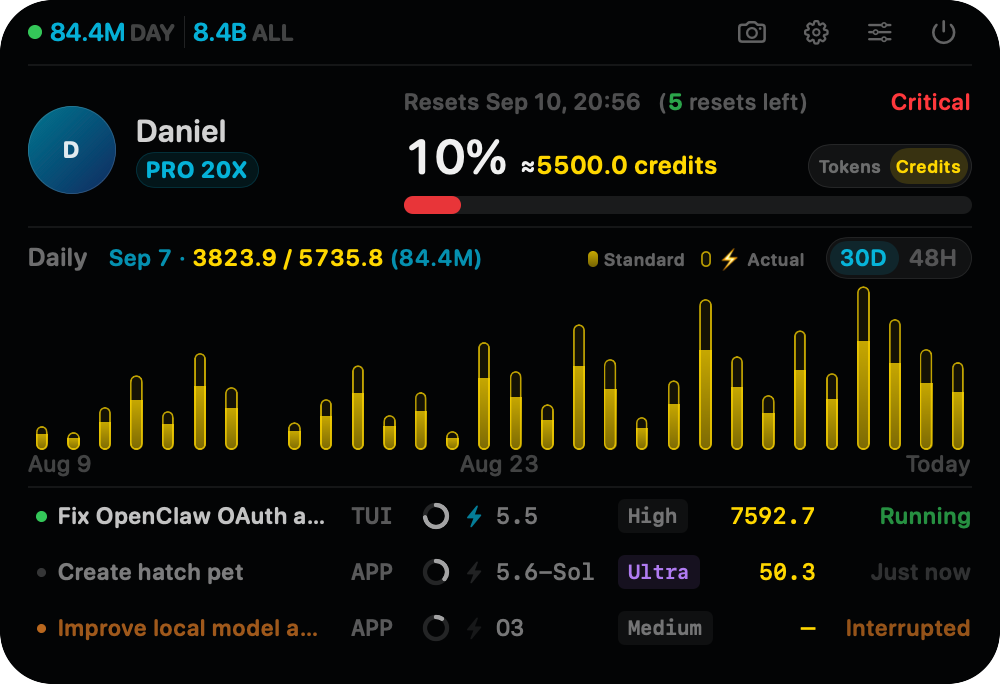

# Codex Island

**English** | [简体中文](README.zh-CN.md)

Codex Island is a floating status island for the top of macOS. It stays compact by default and expands on hover to show Codex account limits, profile identity, lifetime and recent token activity, actual usage and Fast-mode-equivalent usage, plus the source, compact model name, reasoning effort, Fast state, and cumulative token usage of the three most recent threads.

Account details, usage, and the thread index come from read-only endpoints exposed by the local `codex app-server`. Per-thread configuration comes from the latest `thread_settings_applied` event in that thread's local rollout. The profile name and avatar are fetched on demand from the Profile endpoint used by the Codex App; the authentication token is retained only in memory for the duration of the request and is never written to disk or logs. Codex Island does not parse message bodies or call endpoints that consume reset credits.

## Interface Preview

### Compact

| Idle | Consuming tokens |
| :---: | :---: |
|  |  |

### Expanded

Tokens mode:


Credits mode:



> These screenshots are generated by the built-in offscreen preview renderer. Limits, token counts, plan, dates, and thread content shown in them are demonstration data. The `≈ … tokens` value uses the last seven days of local model, cache, output, and Fast usage together with observed quota changes. It is not an exact token allowance returned by Codex and shows “—” when calibration data is insufficient. See [remaining-token estimation](docs/token-estimate.md).

### Settings


## Tokens and Credits

The Tokens / Credits switch controls the remaining-usage display, the 30-day / 48-hour charts, and cumulative usage in the session list. Zero credits display as `0`; other credit amounts use one decimal place.

- **Tokens:** Actual model tokens. “⚡ Equivalent” applies the Fast multiplier recorded for each call. In Tokens mode, the gold number in parentheses is the corresponding local credit cost.
- **Credits:** A reference cost calculated using each call’s recorded model and Fast tier, with separate rates for uncached input, cached input, and output. Cached input is not charged again at the uncached rate; reasoning is already included in output.
- **Standard / ⚡ Actual:** Standard is the cost of the same usage with Fast off. Actual includes Standard and Fast surcharges; Actual minus Standard is the extra cost of enabling Fast. For Standard usage of 100 at 2.5×, Actual is 250 and the extra cost is 150. The solid bar shows Standard; the outline shows the Actual total. Each series can be toggled independently.
- **Local scope:** Chart and session credits are calculated from this computer’s logs. Account token totals can include other computers and need not match. `≥` marks a priced subtotal when some local calls cannot be priced; `—` indicates missing details.
- **Remaining credits:** The app uses a fixed reference allowance of 2,750 for Plus, 13,750 for Pro 5X, and 55,000 for Pro 20X, multiplied by the remaining primary-quota percentage. For example, Pro 20X at 97% displays `≈53350.0 credits`. This is an app estimate, not a credit balance returned by the account API. Unrecognized plan tiers display `—`.
- **Remaining tokens:** Independently calibrated from the last seven days of workload habits and observed quota changes. Insufficient calibration displays `—`.

Session hover cards show “TOTAL USAGE,” with the selected measure first and the other measure in parentheses. Tokens follow the selected theme; credits use gold. See [calculation details and sources](docs/token-estimate.md).

Official sources (verified September 7, 2026):

- [Model credit rates](https://learn.chatgpt.com/docs/pricing#token-rates): separate rates per million uncached input, cached input, and output tokens.
- [Fast mode and credit multipliers](https://learn.chatgpt.com/docs/agent-configuration/speed): **2.5×** Standard consumption for GPT-6 Astra, GPT-5.6, and GPT-5.5; **2×** for GPT-5.4. These are credit multipliers, distinct from speed improvements. API-key billing follows separate rules.

When a session switches models or Fast mode, the app prices each call using its recorded settings and sums the results; the final model does not reprice the entire session. The formula is `credits = Σ[(uncached input × input rate + cached input × cache rate + output × output rate) / 1,000,000 × call multiplier]`. Rates come from the app’s maintained reference table; changes to the official website do not automatically update local rates.

## Install and Run

Pulling the latest source and building locally is recommended. You can also download the latest prebuilt release.

> [!IMPORTANT]
> This project is not signed with an Apple Developer ID certificate and has not been notarized by Apple. When you download the DMG directly, macOS Gatekeeper will typically warn that it cannot verify the developer or that the app may pose a security risk. Build locally using the instructions below if you want to avoid this downloaded-app verification warning.

### Recommended: Build the Latest Source Locally

Requirements: macOS 13 or later, the Swift 6 toolchain, and an installed and authenticated Codex CLI.

Clone the repository for the first time:

```bash
git clone https://github.com/daniel-weih/codex-island.git
cd codex-island
```

If you already have a clone, update it first:

```bash
git pull --ff-only
```

Run directly:

```bash
swift run
```

Package an `.app`:

```bash
./scripts/package_app.sh
open "dist/Codex Island.app"
```

Package the app, DMG, and mounted-volume icon:

```bash
./scripts/package_dmg.sh
open "dist/Codex-Island.dmg"
```

### Download the DMG (Alternative)

**[Download Codex Island DMG](https://github.com/daniel-weih/codex-island/releases/download/v2026.08.28/Codex-Island.dmg)**

The current release is `v2026.08.28` and supports Apple Silicon Macs running macOS 13 or later. The package uses an ad-hoc signature. If macOS blocks the first launch, Control-click the app in Finder and choose **Open**.

### Launch at Login

Launch at login can be enabled in Codex Island settings and is disabled by default. Once enabled, the app writes only its own launch agent under the current user's `~/Library/LaunchAgents/` directory and starts automatically from the next macOS login. The launch agent starts Codex Island directly, so macOS does not identify the background item as the generic `open` command. Legacy launch items are migrated automatically while preserving the enabled state. This mechanism requires neither an Apple Developer certificate nor administrator privileges. Turning it off removes only the Codex Island launch agent and does not affect other login items.

### Development and Validation

If `codex` is not in a common executable path, specify it explicitly:

```bash
CODEX_CLI_PATH=/path/to/codex swift run
```

Run parser checks:

```bash
./scripts/test.sh
```

Probe the local App Server connection in read-only mode (without printing tokens, email addresses, or thread content):

```bash
swift run CodexIsland --probe
```

Render the offscreen preview matrix for compact and expanded states, hover cards, narrow layouts, notchless displays, 1x/2x scales, and data-boundary cases:

```bash
swift run CodexIsland --render-preview dist/previews
```

## Features

- A centered, borderless floating panel visible across all Spaces, adapted for both notched Mac displays and standard external displays
- Automatic expansion when the pointer enters the physical notch area, followed by automatic collapse after the pointer leaves both the notch and expanded panel
- Today's token increase across all locally triggered model calls in the left side of the compact island; while tokens are being consumed continuously, particles flow from the notch toward the daily-token total; the status dot is green while any thread is running and gray otherwise
- Remaining primary rate-limit percentage, next reset time, reset-relative usage pace, and a Token estimate calibrated from official rates, recent workload habits, and observed quota changes
- Switchable Tokens / Credits display, linked to daily/hourly charts and session totals; credits are calculated from local logs, with Standard cost and Actual total cost shown separately
- Available reset credits from `rateLimitResetCredits.availableCount`, with all expiration times available on hover
- Profile avatar and name, lifetime account tokens, and switchable charts for the latest 30 calendar days or previous 48 hours; each chart can show actual usage, Fast-mode-equivalent usage, or both, with hover explanations for their meaning
- Activation of the Codex App by clicking any non-thread area in the expanded island; the top-right actions can copy a transparent rounded PNG, open Codex settings, open Island settings, or quit the app
- Settings for status animation, token-consumption animation, task-completion sound, color theme, interface language, target display, and launch at login; the completion sound and launch at login are disabled by default; target display defaults to automatic and can be pinned to the built-in display or any connected external display, with temporary fallback after disconnection and automatic restoration after reconnection
- Codex account plan plus the source, compact model name (for example `5.6-Sol`), reasoning effort, and Fast status of the three most recent CLI/App threads, with running threads prioritized
- Near-real-time execution state for the three most recent threads: running, idle, interrupted, or failed
- Cumulative token usage for the three most recent threads, with input, cached-input, output, and reasoning-output details on hover
- Opening a thread in the Codex App by clicking its row through the official `codex://threads/<thread-id>` deep link
- Thread list and execution state refresh every second, limits every 30 seconds, and account statistics every 5 minutes; there is no menu bar icon or manual-show entry point

> Execution state is derived from local rollout lifecycle events written by both the CLI and App, and normally updates within one second. If a Codex process exits abnormally without writing a terminal event, an unclosed task with no activity for an extended period is downgraded to **Unknown** instead of being reported as running indefinitely.

## Data Boundaries

The app launches a local `codex app-server` child process over stdio. After `initialize`, it periodically calls:

- `account/read`
- `account/rateLimits/read`
- `account/usage/read`
- `thread/list`

All business-data calls are read-only. To obtain the Codex App profile name and avatar, Codex Island temporarily requests the current token from the local App Server through `getAuthStatus`, then calls the `/wham/profiles/me` endpoint used by the Codex App. The network session uses an ephemeral configuration with no cookies or disk cache; after a 401 response, the token is refreshed and the request is retried at most once. This Profile endpoint is not a public contract. If it fails, the UI falls back to **Codex User** and an initial-letter placeholder without reading the local account name or system avatar, and limits, usage, and thread status remain unaffected.

Codex Island also discovers local CLI/App threads, forks, and sub-agents read-only under `$CODEX_HOME/sessions` and `$CODEX_HOME/archived_sessions`, then scans the corresponding `.jsonl` files. Recent threads are labeled `TUI` or `APP` using the `source` returned by `thread/list`; only model settings, timestamped cumulative `token_count` values, and the `task_started`, `task_complete`, `turn_aborted`, and `error` lifecycle events are extracted. Today's and hourly 48-hour usage is calculated from positive deltas after each model call, so repeated notifications are not double-counted. The equivalent series leaves actual token counts unchanged and applies the documented, model-specific Fast usage multiplier only when usage is charged against ChatGPT limits; unsupported model families are not guessed. Forks begin contributing at their own `session_meta` creation time, while sub-agents begin at their first `inter_agent_communication_metadata` activity boundary, avoiding parent history copied with rewritten timestamps.

Local rollout parsing uses a rolling in-memory cache: unchanged files only require a metadata check, appended files are parsed from the previous end offset, and hour/day boundaries trim expired buckets without rescanning the previous 30 days. Today's bar and compact total use this live local result, while earlier days continue to use the account daily summary. The recent-thread list, execution state, cumulative tokens, and hourly usage refresh every second; the complete local thread index refreshes every 15 seconds; limits refresh every 30 seconds; account statistics use a 5-minute cache; and profile identity uses a 15-minute cache. The child process exits together with the app.

## Third-party Assets

The task-completion sound is “8-bit Jump 001” by EdR via Pixabay. See [THIRD_PARTY_NOTICES.md](THIRD_PARTY_NOTICES.md) for its source and license details.
