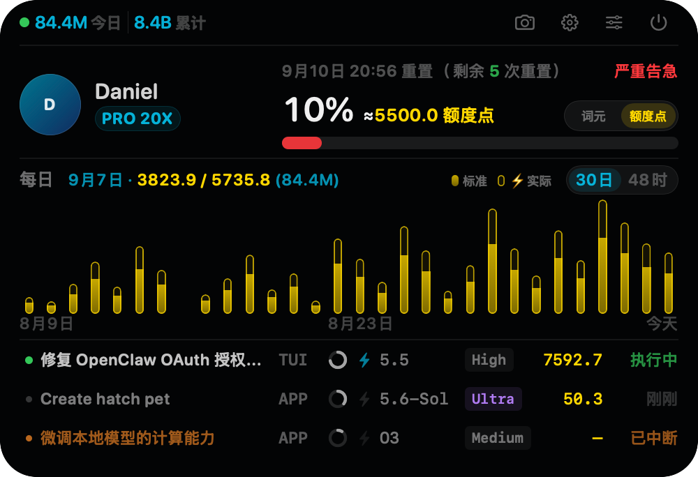

# Codex Island

[English](README.md) | **简体中文**

Codex Island 是一个 macOS 顶部悬浮状态岛。默认保持收起，鼠标移入后展开，展示 Codex 账户额度、Profile 头像与昵称、累计及近期词元活动、实际用量与 Fast 模式等效用量，以及最近三条会话各自的来源、精简模型名、推理强度、Fast 状态和累计词元。

账户、用量和会话索引来自本机 `codex app-server` 的只读接口；会话配置来自该会话本地 rollout 中最近一次 `thread_settings_applied`。Profile 昵称和头像通过 Codex App 当前使用的 Profile 接口按需读取，认证 token 只在请求期间保留于内存，不会写盘或输出到日志。程序不会解析会话消息正文，也不会调用消耗 reset credit 的接口。

## 界面预览

### 收起态

| 静默状态 | Token 消耗中 |
| :---: | :---: |
|  |  |

### 展开态

词元模式：


额度点模式：



> 截图由内置离屏预览生成，其中的额度、词元、套餐、日期和会话内容均为演示数据。`≈ … 词元` 根据最近 7 天本机调用的模型、缓存、输出、Fast 使用比例及实际额度变化估算，不是 Codex 官方返回的精确词元额度。样本不足时显示“—”，详见[剩余 Token 估算口径](docs/token-estimate.md)。

### 设置


## 词元与额度点

顶部“词元 / 额度点”切换会同步改变剩余用量、30 日 / 48 小时柱图及会话列表中的累计消耗。数值为 0 时显示 `0`，其余额度点保留一位小数。

- **词元**：实际处理的 Token；“⚡等效”按各次调用的 Fast 倍率折算。词元模式中，括号内的金色数字为对应的本机额度点。
- **额度点（Credits）**：按每次调用当时的模型费率，分别计算普通输入、缓存输入和输出，再应用当时的 Fast 倍率。缓存不会重复按普通输入计价，推理已包含在输出中。
- **标准 / ⚡实际**：标准是不开启 Fast 时相同用量消耗的额度点；实际包含标准用量及 Fast 加价，实际 − 标准就是开启 Fast 浪费的额度。例如标准为 100、Fast 倍率为 2.5 时，实际为 250，额外消耗为 150。实心柱表示标准，空心轮廓表示实际总量，两项可独立开关。
- **本机统计范围**：图表及会话的额度点仅从本机日志计算，不包含其他电脑的消耗。账户 Token 可能包含其他设备，与本机数量不一致属于正常情况。本机部分调用无法计价时，以 `≥` 标明已知小计；完全没有必要明细时显示 `—`。
- **剩余额度点**：采用固定参考基准，Plus 为 2,750，Pro 5X 为 13,750，Pro 20X 为 55,000，再乘以当前主额度的剩余百分比。例如 Pro 20X 剩余 97% 时显示 `≈53350.0 额度点`。这是项目的估算口径，并非账户接口返回的额度点余额；未知套餐倍数时显示 `—`。
- **剩余词元**：根据最近 7 天的调用组合和实际额度变化校准，与固定基准的剩余额度点估算独立。样本不足时显示 `—`。

会话悬浮详情以“累计消耗”展示，当前模式的数值在前，另一种用量放在括号中；词元跟随主题色，额度点使用金色。详细公式、数据边界与费率来源见[统计与估算说明](docs/token-estimate.md)。

官方来源（核验于 2026-09-07）：

- [模型 Credits 费率表](https://learn.chatgpt.com/docs/pricing#token-rates)：按每百万普通输入、缓存输入和输出 Token 分别列出费率。
- [Fast 模式及额度倍率](https://learn.chatgpt.com/docs/agent-configuration/speed)：GPT-6 Astra、GPT-5.6 和 GPT-5.5 为标准消耗的 **2.5×**，GPT-5.4 为 **2×**。这是额度消耗倍率，不能与速度提升倍率混用；API Key 的计费规则另行适用。

同一会话切换模型或 Fast 模式时，按每次调用记录的设置分别计算后求和，不会用会话最后的模型重算全部历史。计算公式为 `额度点 = Σ[(普通输入 × 输入费率 + 缓存输入 × 缓存费率 + 输出 × 输出费率) / 1,000,000 × 当次倍率]`。费率采用应用内维护的参考表；官网更新不会自动改写本地费率。

## 安装与运行

建议优先拉取最新代码并在本机自行构建；也可以直接下载最新版本安装。

> [!IMPORTANT]
> 当前项目未使用 Apple Developer ID 证书签名，也未经过 Apple 公证。直接下载 DMG 时，macOS Gatekeeper 通常会提示无法验证开发者或存在安全风险。若希望避免这类下载来源校验提示，建议采用下面的本地构建方式。

### 推荐：拉取源码并本地构建

要求：macOS 13 或更高版本、Swift 6 工具链、本机已安装并登录 Codex CLI。

首次获取代码：

```bash
git clone https://github.com/daniel-weih/codex-island.git
cd codex-island
```

如果已经克隆过仓库，请先更新到最新代码：

```bash
git pull --ff-only
```

直接运行：

```bash
swift run
```

打包成 `.app`：

```bash
./scripts/package_app.sh
open "dist/Codex Island.app"
```

打包成带 App、DMG 文件与挂载卷图标的安装包：

```bash
./scripts/package_dmg.sh
open "dist/Codex-Island.dmg"
```

### 直接下载 DMG（备选）

**[下载 Codex Island DMG](https://github.com/daniel-weih/codex-island/releases/download/v2026.08.28/Codex-Island.dmg)**

当前版本为 `v2026.08.28`，支持 macOS 13 及以上的 Apple Silicon Mac。安装包使用 ad-hoc 签名；首次启动若被 macOS 拦截，请在 Finder 中按住 Control 点按应用，选择“打开”。

### 开机启动

可在灵动岛设置中开启“开机启动”。默认关闭；开启后，应用只会在当前用户的 `~/Library/LaunchAgents/` 中写入 Codex Island 专用启动项，并从下一次 macOS 用户登录开始自动运行。启动项直接运行 Codex Island，避免 macOS 将后台项目显示为通用的 `open` 命令；旧版启动项会在新版启动时自动迁移并保持开启。该方式不要求 Apple Developer 证书或管理员权限；关闭开关只会删除 Codex Island 自己的启动项，不会影响其他登录项。

### 开发与验证

如果 `codex` 不在常见路径中，可显式指定：

```bash
CODEX_CLI_PATH=/path/to/codex swift run
```

运行解析器检查：

```bash
./scripts/test.sh
```

只读检查本机 App Server 连接（不会打印 token、邮箱和会话正文）：

```bash
swift run CodexIsland --probe
```

渲染收起/展开、悬浮卡片、窄宽、无刘海、1x/2x 与数据边界状态的离屏预览矩阵：

```bash
swift run CodexIsland --render-preview dist/previews
```

## 当前能力

- 顶部居中、全 Space 可见的无边框悬浮面板，并适配刘海屏与普通外接屏
- 鼠标进入实体刘海区域自动展开，离开刘海和展开面板后自动收起
- 收起态左侧显示本机消息触发的全部模型调用当日 Token 新增量；检测到 Token 持续消耗时，粒子从刘海侧向当日用量方向流动；有会话执行时亮绿点，否则显示灰点
- 主额度的剩余比例、下次重置时间、相对使用节奏，以及结合官方费率、近期使用习惯和实际额度变化校准的 Token 估算
- 词元 / 额度点切换联动每日、分时柱图和会话累计消耗；额度点按本机日志折算，分别展示标准费用与实际总消耗
- `rateLimitResetCredits.availableCount` 显示可用 reset 次数；悬停可查看全部可用次数的到期时间
- Profile 头像、昵称、账户累计词元，以及可切换的近 30 日每日 / 过去 48 小时每小时用量柱图；图表可分别展示实际用量、Fast 模式等效用量或同时展示，并可悬停查看口径说明
- 点击展开态的非会话区域可激活 Codex App；右上角依次提供截图复制、打开 Codex 设置、打开灵动岛设置和退出按钮
- 灵动岛设置支持状态动效、Token 消耗动效、任务完成音效、品牌配色、界面语言、显示器选择与开机启动；任务完成音效与开机启动默认关闭；显示位置默认自动，也可固定到内建屏或任一已连接外接屏，目标屏断开时临时回退并在重连后自动恢复
- Codex 账户套餐，以及最近三条 CLI/App 会话各自的来源、精简模型名（如 `5.6-Sol`）、推理强度和 Fast 状态；执行中的任务优先展示
- 最近三条会话的近实时执行状态：执行中、空闲、已中断或失败
- 最近三条会话的累计 Token；悬停数值可查看输入、缓存输入、输出与推理输出明细
- 点击会话整行可通过官方 `codex://threads/<thread-id>` 深链在 Codex App 中打开
- 会话列表与执行状态每秒刷新，额度每 30 秒刷新，账户统计每 5 分钟刷新；无菜单栏图标或手动展示入口

> 执行状态来自 CLI 与 App 共同写入的本地 rollout 生命周期事件，通常会在 1 秒内更新。若 Codex 进程异常退出、没有写入结束事件，长时间无活动的未闭合任务会降级为“状态未知”，避免一直误报为“执行中”。

## 数据边界

应用通过 stdio 启动一个本地 `codex app-server` 子进程，完成 `initialize` 后定期调用：

- `account/read`
- `account/rateLimits/read`
- `account/usage/read`
- `thread/list`

所有业务调用均为只读。为取得 App Profile 昵称和头像，程序通过本地 App Server 的 `getAuthStatus` 临时取得当前 token，然后请求 Codex App 当前使用的 `/wham/profiles/me`；网络会话使用无 Cookie、无磁盘缓存的临时配置，401 时最多刷新 token 并重试一次。该 Profile 路径不是公开契约，失败时自动回退为“Codex 用户”和昵称首字母占位，不会读取本机账户名或系统头像，也不影响额度、用量和会话状态。

程序还会在 `$CODEX_HOME/sessions` 与 `$CODEX_HOME/archived_sessions` 中只读发现本机 CLI/App 会话、Fork 与子代理，并扫描对应 `.jsonl`；最近会话通过 `thread/list` 的 `source` 标记为 `TUI` 或 `APP`，同时只提取模型设置、带时间戳的 `token_count` 累计用量及 `task_started`、`task_complete`、`turn_aborted`、`error` 生命周期事件。当日和近 48 小时分时用量按每次模型调用后累计值的正向增量计算，重复通知不会重复计数；等效序列不会改变实际词元数，仅在用量计入 ChatGPT 额度时按对应模型的已知 Fast 额度倍率折算，未知模型不会猜测倍率。Fork 从自己的 `session_meta` 创建时间开始计入，子代理则从首个 `inter_agent_communication_metadata` 活动边界开始计入，因此不会重复统计时间戳被重写的父会话历史。

本地 rollout 解析使用滚动内存缓存：未变化的文件只检查元数据，追加内容只从上次文件末尾继续读取，跨小时或日期时仅裁剪过期桶，不再重新扫描最近 30 天。今日柱与收起态今日数值都使用该本地实时结果，之前日期仍来自账户日汇总。最近会话列表、执行状态、累计词元和分时用量每秒刷新，本地全量会话索引每 15 秒刷新，额度保持 30 秒刷新，账户统计使用 5 分钟缓存，Profile 身份使用 15 分钟缓存。退出应用时子进程会一并结束。

## 第三方素材

任务完成音效为 Pixabay 用户 EdR 创作的 “8-bit Jump 001”。素材来源及许可信息见 [THIRD_PARTY_NOTICES.md](THIRD_PARTY_NOTICES.md)。
